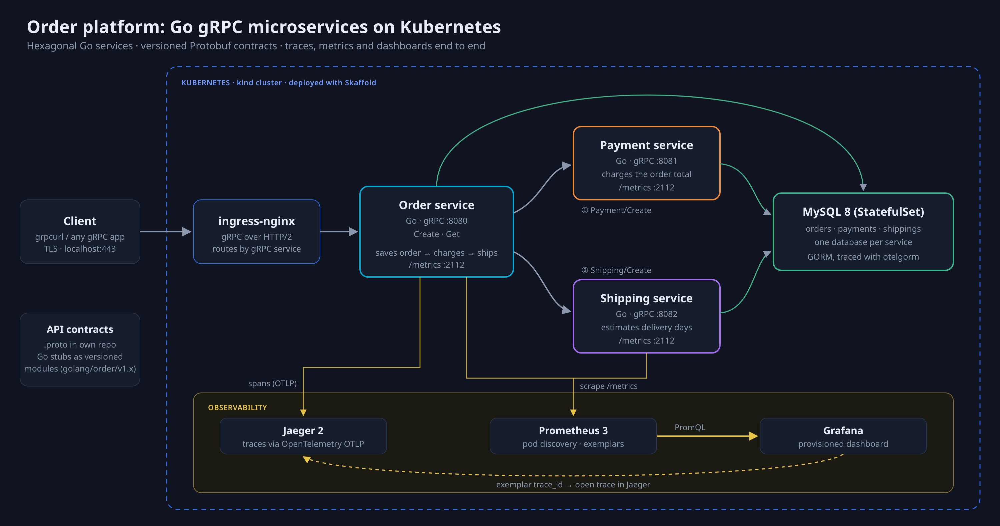
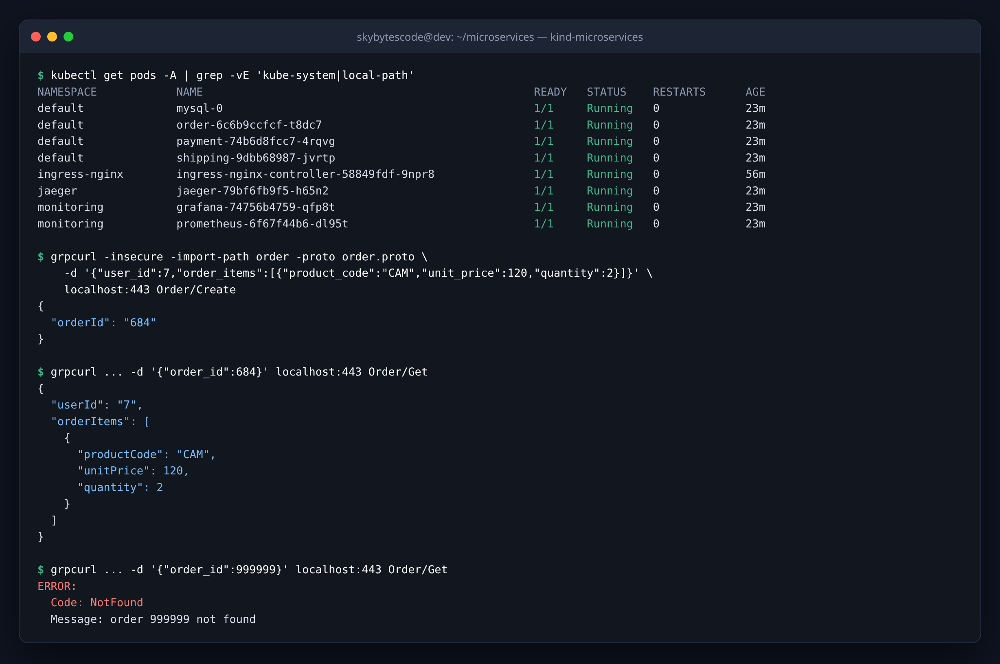
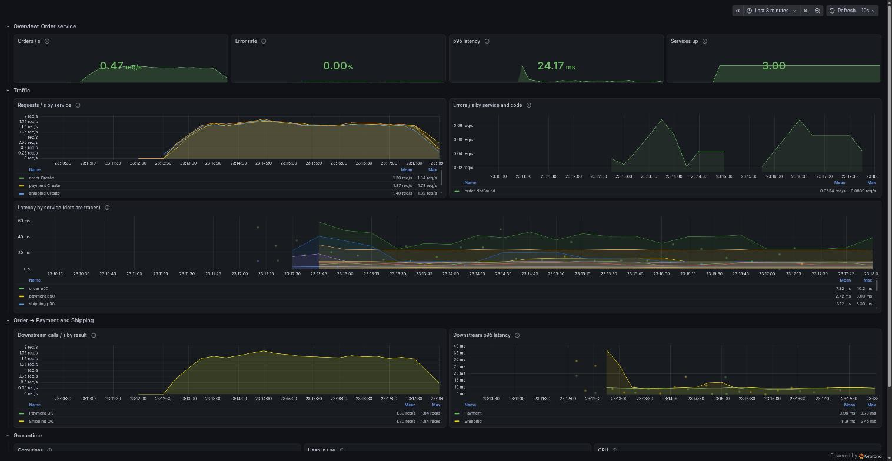
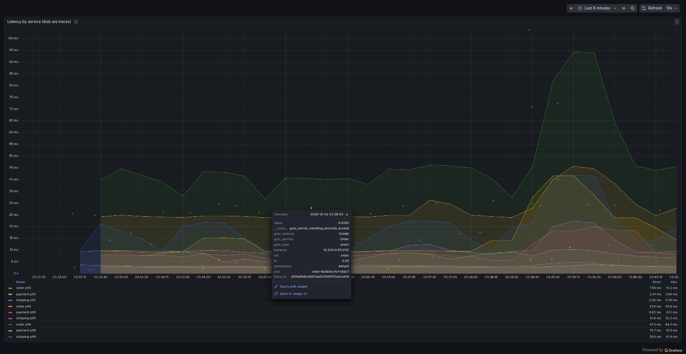
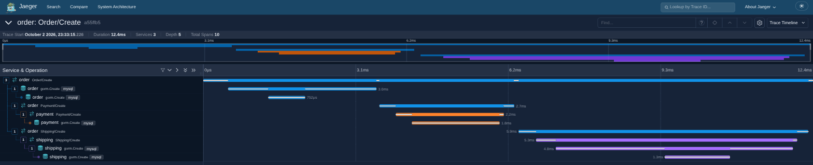
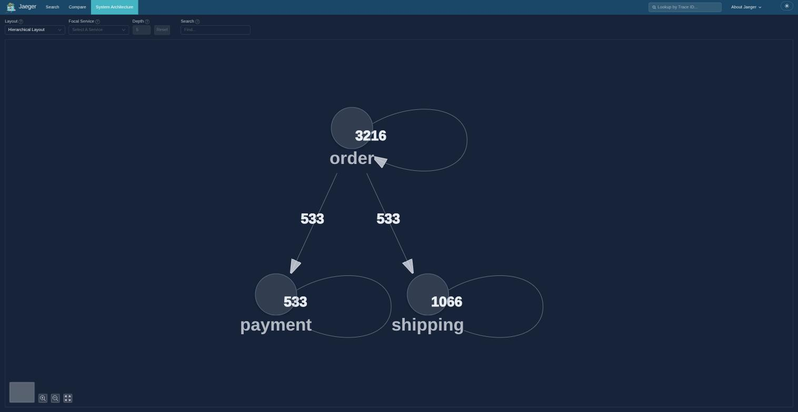
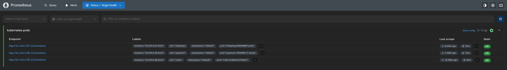

# microservices

Go microservices that talk to each other over gRPC.



| Folder | What it is |
|---|---|
| [`order-service/`](order-service) | Order service: gRPC server with a MySQL (GORM) store |
| [`payment-service/`](payment-service) | Payment service: gRPC server with a MySQL (GORM) store |
| [`shipping-service/`](shipping-service) | Shipping service: gRPC server with a MySQL (GORM) store |
| [`e2e/`](e2e) | End-to-end test: runs the whole stack with Docker Compose |
| [`mysql/`](mysql) | MySQL manifest for Kubernetes |
| [`jaeger/`](jaeger) | Jaeger manifest for Kubernetes (trace collector and UI) |
| [`prometheus/`](prometheus) | Prometheus manifest for Kubernetes (scrapes the services' metrics) |
| [`grafana/`](grafana) | Grafana for Kubernetes, with its data sources and the Microservices dashboard (kustomize) |
| [`kind/`](kind) | Config for the local kind cluster |

`order-service`, `payment-service`, `shipping-service` and `e2e` are each their own Go module,
tied together by `go.work`.

The `.proto` contracts and the Go code generated from them live in
[skybytescode/microservices-proto](https://github.com/skybytescode/microservices-proto).
Each service's stubs are a separate module there, released with tags like
`golang/order/v1.0.0`. To use a new version in a service:

```sh
cd order-service
go get github.com/skybytescode/microservices-proto/golang/order@v1.0.1
```

## Screenshots

| | |
|---|---|
|  Pods on kind and real gRPC calls |  Grafana dashboard |
|  Latency sample linked to its trace |  One order traced across all services |
|  Service graph from live traffic |  Pods discovered by Prometheus |

## How the services talk

A client calls `Order.Create`. Order saves the order, then calls `Payment.Create`
over gRPC to charge the total price. Once the charge succeeds, it calls
`Shipping.Create` with the order's items; Shipping saves the shipment and
estimates delivery at one day plus one more for every 5 items. If the charge or
the shipment fails, Order returns `InvalidArgument` with that service's error in
the status details.

## Run everything on Kubernetes

Runs on a local [kind](https://kind.sigs.k8s.io/) cluster named `microservices`,
deployed with [Skaffold](https://skaffold.dev/). Requests reach the services
through ingress-nginx on `localhost:443`.

### 1. Create the cluster (once)

```sh
kind create cluster --config kind/kind-config.yaml
```

[`kind/kind-config.yaml`](kind/kind-config.yaml) maps `127.0.0.1:80` and
`127.0.0.1:443` into the cluster. Port mappings can only be set when a cluster
is created, so changing them means deleting and recreating it
(`kind delete cluster --name microservices`).

### 2. Install the ingress controller (once)

```sh
kubectl apply -f https://raw.githubusercontent.com/kubernetes/ingress-nginx/controller-v1.15.1/deploy/static/provider/kind/deploy.yaml
kubectl -n ingress-nginx wait --for=condition=ready pod \
  --selector=app.kubernetes.io/component=controller --timeout=180s
```

### 3. Deploy

```sh
skaffold dev
```

This builds the `order`, `payment` and `shipping` images, loads them into the
cluster and deploys Jaeger, Prometheus, Grafana, MySQL, Order, Payment and Shipping. It rebuilds when you save a file and
removes everything on Ctrl+C. Use `skaffold run` to deploy once and
`skaffold delete` to remove it. [`skaffold.yaml`](skaffold.yaml) always deploys
to the `kind-microservices` context, whatever your current context is.

### 4. Call the Order service

```sh
cd ../microservices-proto   # a clone of skybytescode/microservices-proto
grpcurl -insecure -import-path order -proto order.proto \
  -d '{"user_id":1,"order_items":[{"product_code":"CAM","unit_price":10,"quantity":2}]}' \
  localhost:443 Order/Create
```

- The Ingress sends paths starting with `/Order` to the `order` service,
  `/Payment` to the `payment` service and `/Shipping` to the `shipping` service.
- gRPC through ingress-nginx needs TLS. The controller answers with its built-in
  self-signed certificate, hence `-insecure`.
- The pods run with `ENV=prod`, which turns off gRPC reflection, so grpcurl
  needs the `.proto` files.

### 5. Open the Jaeger UI

```sh
kubectl -n jaeger port-forward svc/jaeger-otel 16686:16686
```

Open http://localhost:16686, pick service **order** and click **Find Traces**.
An `Order/Create` call shows up as one trace across Order, Payment and Shipping. Jaeger
keeps traces in memory, so they are lost when its pod restarts. So is the MySQL
data: MySQL has no persistent volume.

### 6. Open the Prometheus UI

```sh
kubectl -n monitoring port-forward svc/prometheus 9090:9090
```

Open http://localhost:9090. **Status → Targets** lists the `order`, `payment`
and `shipping` pods. Some queries to try:

| Query | Shows |
|---|---|
| `sum by (job, grpc_method, grpc_code) (rate(grpc_server_handled_total[5m]))` | Requests per second per service, method and status code |
| `histogram_quantile(0.95, sum by (le, job) (rate(grpc_server_handling_seconds_bucket[5m])))` | 95th percentile latency per service |
| `sum by (grpc_service, grpc_code) (rate(grpc_client_handled_total[5m]))` | Order's calls to Payment and Shipping, by result |

In the graph view, turn on **Show exemplars**: each dot carries the `trace_id`
of a request, which you can open in Jaeger. Like Jaeger, Prometheus keeps its
data in the pod, so it is lost when the pod restarts.

### 7. Open the Grafana dashboard

```sh
kubectl -n monitoring port-forward svc/grafana 3000:3000
```

Open http://localhost:3000. The **Microservices** dashboard is the home page,
with no login (fine for a local cluster only). It shows:


- **Overview:** orders per second, error rate, p95 latency of Order and how many service pods are up
- **Traffic:** requests and errors per second for each service, and p50/p95/p99 latency
- **Order → Payment and Shipping:** Order's downstream calls by result, and their p95 latency
- **Go runtime:** goroutines, heap and CPU per service

The dots on the latency graphs are exemplars: click one and choose
**Open in Jaeger UI** (with the Jaeger port-forward from step 5 running), or
**Query with Jaeger** and pick the **TraceID** query type, to open that request's trace. The dashboard lives in
[`grafana/dashboards/microservices.json`](grafana/dashboards/microservices.json);
changes made in the UI are lost when the pod restarts, so export them to that
file to keep them.

### Troubleshooting

| Symptom | Likely cause |
|---|---|
| `kind create` fails with "address already in use" | Something else uses port 80 or 443: `sudo ss -ltnp \| grep -E ':80 \|:443 '` |
| grpcurl: `connection refused` | The ingress controller is not ready yet; rerun the `wait` from step 2 |
| grpcurl: `404` or `Unimplemented` | The Ingress is missing: `kubectl get ingress` |
| Pods log `Unauthorized`, calls time out | The system clock jumped back and the pods' tokens are now "from the future"; delete the `kube-proxy`, `coredns` and `kindnet` pods in `kube-system` and restart ingress-nginx and the services |
| Grafana: Jaeger data source returns `404` | Jaeger 2.21 dropped the API Grafana uses; keep the image at 2.20 |
| Pods stuck in `Init` | MySQL is not ready yet; the init container waits for it |

## Tests

```sh
cd order-service && go test ./...   # unit tests + MySQL integration test (needs Docker)
cd e2e && go test ./...             # builds both images and runs the full stack (needs Docker)
```

## Tracing

Both services export OpenTelemetry traces over OTLP when
`OTEL_EXPORTER_OTLP_ENDPOINT` is set (for example `http://localhost:4318` for a
local Jaeger). Logs are JSON and include `trace_id` and `span_id`.

## Metrics

Each service serves Prometheus metrics on `/metrics` when `METRICS_PORT` is set
(`2112` in the Kubernetes manifests): gRPC server request counts and latency
histograms, Go runtime and process metrics, and, for Order, client metrics for
its calls to Payment and Shipping. Latency samples carry the request's trace ID
as an exemplar. Prometheus scrapes every pod annotated
`prometheus.io/scrape: "true"` on its container port named `metrics`.
